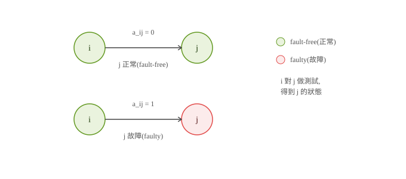

# 20260915 王大進教授 網路診斷與容錯
# System-Level Diagnosis 筆記

## 研究背景
- 大型多處理器 / 多電腦系統會用「互連網路」把節點（處理器/電腦）連起來。
- 系統越大、網路攻擊越多，節點故障（faulty node）幾乎無法避免。
- 目標：找到一個方法，能在有故障節點的情況下，找出「哪些節點壞了」。

## 系統級故障診斷（System-Level Diagnosis）
- 核心概念：讓節點之間**互相測試**，藉此找出壞掉的節點。
- 節點 i 可以測試鄰居節點 j，結論是 j「good（正常）」或「bad（故障）」。

## 關鍵問題：測試者本身可能也是壞的
- 如果發起測試的節點 i 自己就是故障節點，那它給出的測試結果**不可靠、不可信**。
- 這代表：光看單一測試結果不夠，要看整體的「症狀（syndrome）」組合。

## PMC Model（Preparata–Metze–Chien, 1967）
- 最早的系統級診斷模型。
- 由一個集中式仲裁者（centralized arbiter收集所有測試結果（syndrome），判斷每個節點是 faulty 還是 fault-free。

節點 i 對節點 j 做測試,測試結果 a_ij：0 表示 j 正常,1 表示 j 故障。

## t-Diagnosability（診斷度）
- 直覺：壞節點太多的話，仲裁者就無法正確判斷（因為太多測試結果不可信）。
- 定義：對於一個網路，存在一個最大允許壞節點數 **t**，只要壞節點數不超過 t，仲裁者就能正確辨識出所有壞節點。
- 這個 t 就叫做該網路的「診斷度」。

## Conditional Diagnosability（條件診斷度）
- 原本的 t-diagnosability 對壞點分布沒有任何限制（可以任意分布）。
- 後來研究者提出一個更合理的假設：**任一節點的所有鄰居不可能同時全部故障**。
- 在這個較合理的假設下，系統能容忍的壞節點數可以大幅提高。